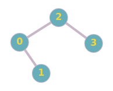
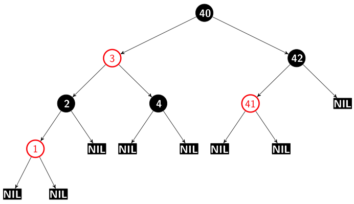
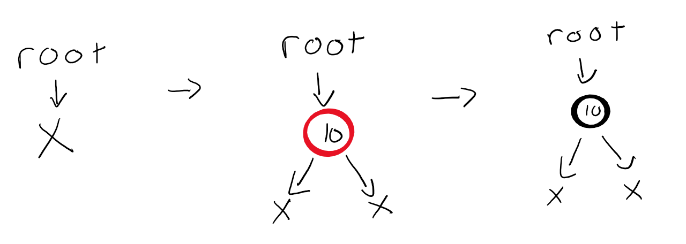
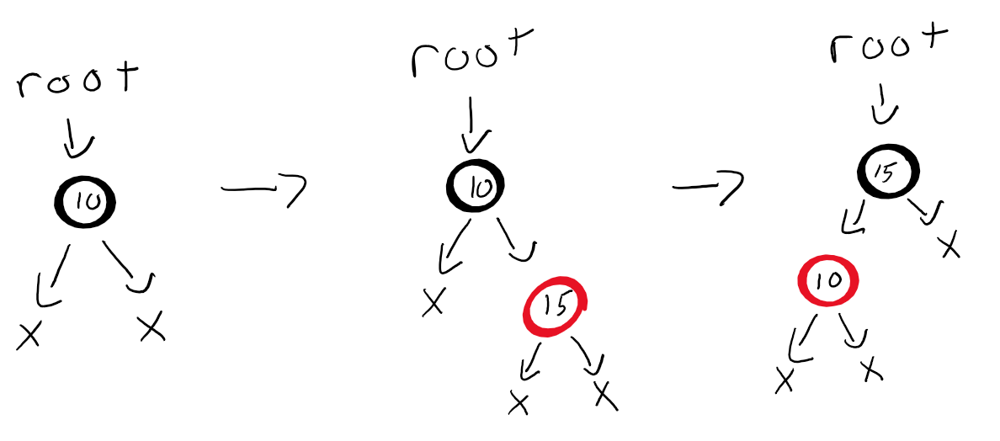
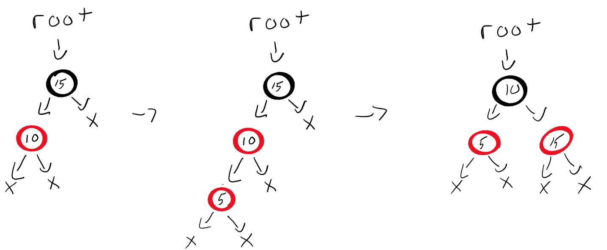
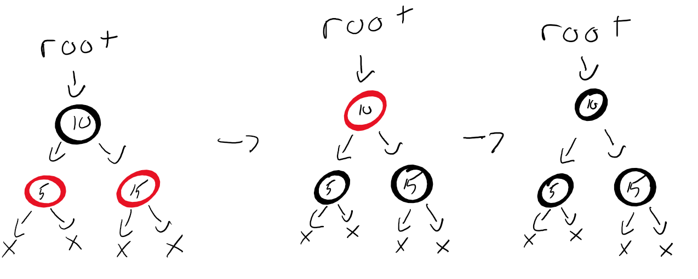

# Lab 06: Balancing Act

## 1. Introduction

Today you will be turning a regular Binary Search Tree into a Balanced Binary Search Tree. Don't worry about having to implement a tree class all over again; this time we have provided you with a working implementation. All you have to do is modify the `insert` method to allow for balanced insertions, as well as add any additional helper functions you need. First we will go over what it means for a BST to be balanced, then some different implementations for balancing, and finally the starter code.

## 2.0 Balanced Binary Search Trees

#### Why do we need to balance?

Binary search trees are a nice idea, but they fail to accomplish our goal of doing lookup, insertion and deletion each in time O(log2(n)), when there are n items in the tree. Imagine starting with an empty tree and inserting 1, 2, 3 and 4, in that order.

     1      1        1           1
             \        \           \
              2        2           2
                        \           \
                         3           3
                                      \
                                       4

You do not get a branching tree, but a linear tree. All of the left subtrees are empty. Because of this behavior, in the worst case each of the operations (lookup, insertion and deletion) takes time Θ(n). From the perspective of the worst case, we might as well be using a linked list and linear search. 

#### Balancing

When to balance a BST is generally based on the height of it's sub-trees. A node will be unbalanced if the heights of its sub-trees differ by more than 1. A tree will be *height-balanced* if all of its nodes are balanced. 

**Example of unbalanced tree:**


Notice how the node with value `76` in the right sub-tree has a left sub-tree of height 3, but a right sub-tree of height 0. Notice the same discrepancy in the left sub-tree at node with value `9`. Both of these problems are grounds for balancing.

**Example of tree after balancing:**


Notice the heights of the sub-trees in the balanced version above, they only ever differ by 1, thus they pass our height requirement. Also notice the differing arrangement of nodes: the node with value `12` is now the parent of nodes `9` and `14`, the node with value `72` is now the parent of nodes `54` and `76`. We performed swaps on nodes based on their values and the heights of sub-trees. 

#### Rotations

We've seen why we need to Balance Binary Search Trees, when to balance them, and what an unbalanced tree versus a balanced tree looks like, but how do we perform the swaps necessary to achieve the correct result? 
In the examples above, the trees were balanced by using rotations. If the height of a left sub-tree is greater than or equal to the height of the right sub-tree plus 2, then we perform a right rotation. Inversely, if the height of a right sub-tree is greater than or equal to the height of the left sub-tree plus 2, then we perform a left rotation. 

Heights of left sub-tree = L and right sub-tree = R

If L >= (R + 2) then rotate right.
If R >= (L + 2) then rotate left.

**Example of Rotate Left Function**

```C++
RBTNode* RBTree::rotateLeft(RBTNode* root){
    RBTNode* p = node->right;
    node->right = node->right->left;
    p->left = node;
    return p;
}
```
The above `rotateLeft` method would turn this tree:


In to this tree:



## 3.0 Red-Black Trees


**Definition of a red-black tree**

A red-black tree is a binary search tree which has the following red-black properties:
<ul>
    <li>Every node is either red or black.</li>
    <li>Root of the tree & null leaves are always black</li>
    <li>The children of a red node are black.</li>
    <li>Every simple path from a node to a descendant leaf contains the same number of black nodes.</li>
</ul>

#### Insert Operation

 The goal of the insert operation is to insert key K into tree T, maintaining T's red-black tree properties. A special case is required for an empty tree. If T is empty, replace it with a single black node containing K. This ensures that the root property is satisfied.

If T is a non-empty tree, then we do the following:

<ol>
    <li>Use the BST insert algorithm to add K to the tree</li>
    <li>Color the node containing K red</li>
    <li>Restore red-black tree properties (if necessary)</li>
</ol>


> [Source](http://pages.cs.wisc.edu/~paton/readings/Red-Black-Trees/)

## 3.1 Left-Leaning Red-Black Trees



#### Definition of a left-leaning red-black tree

A left-leaning red-black tree is an easier variant of the red-black tree to implement, while still guaranteeing search/delete/insert operations in O(log n) time. The properties of the left-leaning red-black tree are mostly the same as the regular red-black tree, with the following additional traits:

<ul>
    <li>No Node has a BLACK LEFT child and RED RIGHT child.</li>
    <li>No Node has a RED LEFT child and RED LEFT grandchild.</li>
    <li>No Node has a RED LEFT child and RED RIGHT child.</li>
</ul>

The first insert works the same:



- If a node has a BLACK LEFT child and a RED RIGHT child, left-rotate the Node & swap colors



- If a node has a RED LEFT child and a RED LEFT grandchild, right rotate & swap colors



- If both LEFT and RIGHT children are RED, invert colors of all 3 Nodes



You may use the following website to visualize any tree of your choosing: https://tjkendev.github.io/bst-visualization/red-black-tree/left-leaning.html

The data structure was introduced in [this paper](https://sedgewick.io/wp-content/themes/sedgewick/papers/2008LLRB.pdf); give it a read if you are struggling to understand.

## 4.0 Starter Code

The starter code consists of a `main.cpp` file containing the interface to generates the output expected by the autograder.

You are also given the solution to last week's lab: a working Binary Search Tree. Feel free to use this as the base for your solution though you are welcome
to use your own solution from last week's lab.

### 4.1 Class Contents

In LLRBTNode:

+ An integer for storing the node's data
+ A LLRBTNode* which points to a node's left child
+ A LLRBTNode* which points to a node's right child
+ A base constructor which sets the node's value to 0 and left and right pointer's to null
+ A constructor which sets a given int parameter to the node's value

In LLRBTree:

* A LLRBTNode* which points to the root of the RBTree
* A constructor which sets the root pointer to null
* An `insert` method which will need to be reworked to allow for balanced insertion
* A `clear` method which deletes the root node and sets the pointer to null
* `pre/post/inorder` display functions that output `value:color` 
* `rotateLeft` and `rotateRight` functions to help with re-balancing
* `flipColors` that inverts the colors of a node & its children
* `height` method that returns the height of a tree given the root node

## 5.0 Task

As we have mentioned at length above, the purpose of this lab is to modify the existing insert method to allow for balanced insertions. 

The nodes in your tree should be printed in the format `value:red?` where `red` is a 1 or 0.

Program arguments: `<input file name> <mode> <output file name>`

Example execution:
`./a.out test_1.txt 1 output_1.txt`

test_1.txt
```
9 6 5 3 8 2 4 10 7 1
```

Output (in file output_1.txt):
```
9:0 
9:0 6:1 
6:0 5:0 9:0 
6:0 5:0 3:1 9:0 
6:0 5:0 3:1 9:0 8:1 
6:0 3:1 2:0 5:0 9:0 8:1 
6:0 3:1 2:0 5:0 4:1 9:0 8:1 
6:0 3:0 2:0 5:0 4:1 9:0 8:0 10:0 
6:0 3:0 2:0 5:0 4:1 9:0 8:0 7:1 10:0 
6:0 3:0 2:0 1:1 5:0 4:1 9:0 8:0 7:1 10:0 
Tree Height: 3
```

## 5.1 Bonus Task
This lab has a bonus exercise worth 5 points (20% of the lab.)

Implement the functionality to remove a node from the left-leaning binary search tree.

The strategy for removal can be read about in the [paper linked above](https://sedgewick.io/wp-content/themes/sedgewick/papers/2008LLRB.pdf).

## 6.0 Submission

You will submit 3 files to gradescope:
- `main.cpp`
- `llrbtree.cpp`
- `llrbtree.h`

If you are undertaking the bonus exercise, submit these additional files:
- `main_ec.cpp`
- `llrbtree_ec.cpp`
- `llrbtree_ec.h`
